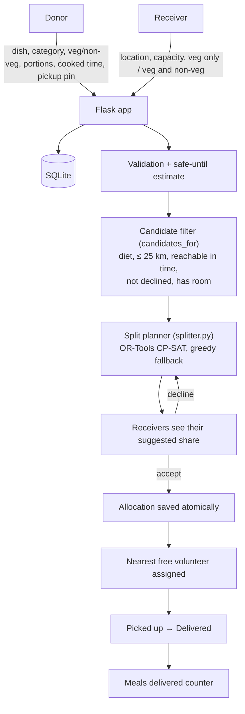

# NOURA — Where Surplus Finds Purpose

> NOURA is a food redistribution platform that connects surplus food from events with nearby orphanages, shelters and community kitchens. An optimisation model (Google OR-Tools CP-SAT) decides how one large donation should be split across several suitable receivers, and the nearest free volunteer is assigned to carry each share before the food stops being safe to eat.

NOURA was earlier called **FoodBridge**. The code, the web UI and the database file (`foodbridge.db`) still use the old name.

## Team

**Team Name:** AIgnite

| Member            | Contribution |
| ----------------- | ------------ |
| B Aswin           | Project architecture, application logic, optimisation integration, GitHub and documentation |
| C B Arunvanan     | Split-planning optimisation (OR-Tools) and matching logic |
| E Sivam Pandiyan  | Web interface (Flask templates, CSS, JavaScript, Leaflet maps) and user experience |
| Pragadeeshvaran R | Donor and receiver data handling, integration and testing |

---

## Problem Statement

### The Problem

Large events such as college fests, conferences, weddings and corporate gatherings prepare food based on expected attendance. When fewer people turn up, a lot of good, prepared food is left over.

At the same time, orphanages, shelters and community kitchens nearby could use those meals.

The gap is usually not the food or the willingness to receive it. It is **connecting the surplus with the right receiver fast enough**. Today that means phone calls, messages, searching for organisations and arranging someone to carry the food, all while the food has only a few hours before it is no longer safe.

### Why We Chose This Problem

Food waste and food need often exist a few kilometres apart, at the same time. The surplus is lost simply because nobody finds the right receiver in time.

We built NOURA around one idea:

> **If good food is available, it should have a chance to reach someone who can use it.**

---

## Solution

NOURA is a web application with three roles:

- **Donors** (event organisers, caterers, halls) post leftover food: dish, food category, veg / non-veg, number of portions, time it was cooked, and the pickup point on a map.
- **Receivers** (orphanages, shelters, community kitchens) register their location, how many portions they can take, and whether they accept veg only or veg and non-veg.
- **Volunteers** carry each accepted share from the pickup point to the receiver.

When food is posted, NOURA estimates how long it stays safe, filters out receivers that can't take it, and plans how to split the portions across the best receivers. Each receiver sees only its suggested share and can accept or decline. Every accepted share is automatically given to the nearest free volunteer, and progress is tracked from posted to delivered.

### Key Features

- **Food-safety window:** a safe-until time is estimated from the food category and cooking time. Food already past its window can't be listed, and expired donations stop being offered.
- **Veg / non-veg matching:** non-veg food is never offered to, or accepted by, a veg-only receiver. The server re-checks this on accept, not only in the UI.
- **AI split planning:** one large donation is split across up to 4 receivers using a CP-SAT optimisation model (see below).
- **Automatic re-planning:** if a receiver declines, accepts, or a new receiver signs up, the plan for the remaining portions is recalculated.
- **Automatic volunteer assignment:** each accepted share gets the nearest available volunteer.
- **Live tracking on maps:** Leaflet + OpenStreetMap maps with pickup and drop-off pins, road routes (OSRM), a status tracker (Posted → Accepted → Picked up → Delivered), and a Google Maps directions link. Dashboards refresh every 6–8 seconds.
- **Impact counter:** the home page shows meals delivered, deliveries, donors and receivers.

---

## Innovation and Differentiation

Most food-sharing setups are a list of posts that receivers browse, or a chain of phone calls. NOURA treats it as an **allocation problem** instead:

- A wedding with 120 leftover portions shouldn't go to one shelter that can only use 30. NOURA splits the donation so more people are fed, while avoiding tiny deliveries that waste a volunteer's trip.
- The plan considers **fairness**: receivers who haven't received food today are preferred.
- Hard safety and practicality rules (diet, distance, time to reach before the food spoils, capacity) are applied before anything is offered.

The AI here is not a chatbot added on top. The optimisation model is the core of the matching workflow, and every suggestion comes with a plain reason (for example, "2.3 km away, room for 50, no food received yet today").

Humans stay in control: receivers accept or decline every suggested share, donors can cancel unclaimed portions, and volunteers confirm pickup and delivery.

---

## Technical Implementation

### Architecture



In the browser, Leaflet draws the maps using OpenStreetMap tiles, Nominatim handles place search, and OSRM draws road routes.

### Technology Stack

| Category            | Technologies |
| ------------------- | ------------ |
| **Frontend**        | Server-rendered HTML with **Jinja2** templates, **CSS** and plain **JavaScript**. **Leaflet 1.9.4** (bundled in `static/vendor/leaflet`) for maps. Pages poll the backend every 6–8 s for live updates. |
| **Backend**         | **Python** and **Flask**. Handles routing, login, form validation, candidate filtering, split planning, volunteer assignment and delivery tracking. Passwords are hashed with **Werkzeug**. |
| **Database**        | **SQLite** (`foodbridge.db`, created on first run). Tables: `users` (donors and receivers), `volunteers`, `donations`, `allocations` (one row per receiver share = one volunteer trip), `declines`. |
| **AI / ML**         | **Google OR-Tools CP-SAT** constraint optimisation for splitting donations, plus rule-based food-safety windows and a rule-based score for ordering a receiver's offers. No trained ML model and no LLM. |
| **Infrastructure**  | Runs locally on the Flask development server at `127.0.0.1:5000`. Not deployed. |
| **APIs / Services** | **OpenStreetMap** tiles, **Nominatim** (place search and reverse geocoding), **OSRM** public server (road routes and drive time shown on maps), **Google Maps** directions links. All are called from the browser; the backend makes no external API calls. |

### How It Works

1. **Posting food.** The donor fills in the dish and picks the pickup point on the map. `estimate_safe_until()` adds a shelf-life (from a table, e.g. 4 h for cooked rice / biryani, 3 h for dairy, 24 h for dry snacks) to the cooking time. Food already past this window is rejected.
2. **Filtering receivers.** `candidates_for()` in `app.py` keeps only receivers that accept the food's diet type, are within 25 km, can be reached before the safe-until time (straight-line distance at 25 km/h plus 20 min handling), haven't declined or already taken a share of this donation, and still have room.
3. **Planning the split.** `plan_split()` in `splitter.py` builds a small CP-SAT model. For each candidate it decides how many portions they get (`x`) and whether they get a trip at all (`y`).
   - Constraints: total ≤ open portions; each share ≤ receiver's remaining room; each used receiver gets at least 5 portions (or its full room if smaller); at most 4 receivers per donation.
   - Objective: maximise portions delivered first, then prefer receivers with more need today, then fewer and shorter trips. Each portion is worth `1000 + 200·need − 10·distance`, and each trip costs `300 + 20·distance`.
   - Solver limited to 2 seconds, single worker so the same input always gives the same plan. Only the 15 nearest candidates are considered.
   - If OR-Tools isn't installed, a greedy planner is used instead.
4. **Receiver decision.** Each receiver sees only donations where the current plan gives them a share, with the reason. On accept, the server re-runs the filters and claims the portions with a conditional `UPDATE`, so two receivers can't take the same portions. On decline, the receiver is excluded and the plan is recalculated for the others.
5. **Volunteer assignment.** `assign_volunteers()` gives every accepted, unassigned share the nearest available volunteer. The volunteer marks "picked up" and "delivered", then becomes available again at the drop-off location.
6. **Tracking.** Donor, receiver and volunteer pages show routes, status and contact details, and refresh automatically.

### Technical Decisions

- **Optimisation instead of an LLM.** Splitting portions under capacity, minimum-share and trip limits is a constrained allocation problem. A CP-SAT solver gives a provably feasible plan, is deterministic, runs in milliseconds for this size, and is easy to explain.
- **Hard rules outside the solver.** Diet, distance and time checks are done in plain Python before the model is built. This keeps the model tiny and lets the same checks be re-run when a receiver accepts.
- **The plan is computed, not stored.** The split plan is recalculated from current data each time a page loads or polls. That is how re-planning after an accept, decline or new receiver happens without extra code.
- **Straight-line distance in the backend.** Matching uses the haversine distance so the core logic works without any external service. OSRM road routes are only used for display in the browser, and fall back to a straight dashed line if OSRM is unreachable.
- **Atomic claims.** Accepting a share uses `UPDATE ... WHERE remaining >= ?` and a unique `(donation_id, receiver_id)` constraint to prevent double allocation.
- **Safe defaults when migrating.** An older single-receiver database is upgraded in place; old receivers become "Veg only" and old donations "Non-veg", so nothing unsafe is offered by accident.
- **Leaflet bundled locally** so the app's map library loads even on slow event Wi-Fi (map tiles still need internet).

---

## Implementation During the Hackathon

During the Hack Day, the team built the full working prototype:

- Flask backend with SQLite schema, phone + password login and separate donor, receiver and volunteer views.
- Map-based location picking (click, drag, place search, GPS) for donors and receivers.
- Food-safety window estimation and expiry of old donations.
- The first version with one receiver per donation, then extended to **multi-receiver split planning with OR-Tools CP-SAT**, veg / non-veg matching, accept / decline with automatic re-planning, and an in-place database migration from the earlier version.
- Nearest-volunteer assignment and pickup / delivery tracking with live maps and routes.
- Home page impact counters.

Team contributions are listed in the [Team](#team) section.

## Working Application

**Live Application:** Not deployed. The app runs locally (see [Setup and Usage](#setup-and-usage)).

What can be tested locally: registering donors and receivers, posting food, seeing the AI split plan on the donor map, accepting / declining as a receiver, and moving a delivery through pickup and drop-off on the Volunteers page.

## Demo Video

**Demo Video:** [Add video URL]

## Open Source and AI Usage

### AI / Models

- **Google OR-Tools CP-SAT solver** (`splitter.py`): the optimisation engine that splits one donation across multiple receivers, respecting receiver capacity, minimum useful share size (5 portions), maximum receivers per donation (4), and preferring need and shorter trips.
- **Rule-based food-safety window** (`SHELF_LIFE_HOURS`, `estimate_safe_until()` in `app.py`): a manually defined shelf-life per food category, used to block unsafe listings and to reject receivers that can't be reached in time.
- **Rule-based offer score** (`match_score()` in `app.py`): orders the offers a receiver sees, using distance, time left and capacity fit.

NOURA does **not** use a generative AI model or LLM (such as GPT, Qwen, Llama or Mistral), and no trained ML model.

### Open Source Components

- **Flask** (with Jinja2 and Werkzeug): web framework, templating and password hashing.
- **SQLite**: local database.
- **Google OR-Tools**: CP-SAT solver for split planning.
- **Leaflet 1.9.4**: interactive maps (bundled in `static/vendor/leaflet`).
- **OpenStreetMap**: map tiles and map data.
- **Nominatim**: place search and reverse geocoding.
- **OSRM (Open Source Routing Machine)**: road routes, distances and drive times shown on the maps.
- **Google Maps** (not open source): optional directions link for turn-by-turn navigation.

### Data / Datasets

- No external dataset is used.
- Donor, receiver and donation data is entered by users and stored in SQLite. No donor or receiver data is pre-loaded.
- **Volunteers are demo data:** 5 volunteers around Kochi / Angamaly are seeded on first run (`DEMO_VOLUNTEERS` in `app.py`). There is no volunteer sign-up yet.
- Food shelf-life rules are manually defined, not learned from data.

### Licenses and Attribution

- **OpenStreetMap data**: © OpenStreetMap contributors (ODbL). Attribution is shown on every map.
- **Leaflet**: BSD-2-Clause
- **Google OR-Tools**: Apache License 2.0
- **Flask, Jinja2, Werkzeug**: BSD-3-Clause
- **SQLite**: Public domain
- **OSRM**: BSD-2-Clause
- **Nominatim / OSRM public servers**: used under the OpenStreetMap Foundation and OSRM demo-server usage policies (light, demo-level use only).

---

## Setup and Usage

### Prerequisites

- Python 3.9 or newer (tested with Python 3.12)
- pip
- A browser with an internet connection (for map tiles, place search and routes)

### Installation

```bash
git clone [repository-url]
cd foodbridge
python -m venv venv
source venv/bin/activate        # Windows: venv\Scripts\activate
pip install -r requirements.txt
```

### Environment Variables

See `.env.example`.

```env
SECRET_KEY=
```

`SECRET_KEY` signs the login session cookie. It is optional for a local demo (a development default is used), but should be set to a long random value anywhere else. The app reads it from the environment, so set it in your shell before running, for example `export SECRET_KEY=...` (Windows PowerShell: `$env:SECRET_KEY="..."`).

### Running the Project

```bash
python app.py
```

Open http://127.0.0.1:5000. The database `foodbridge.db` is created automatically on first run. Delete it to start fresh.

### Usage

Use two browser windows (one normal, one incognito) so the donor and receiver logins don't replace each other.

1. Register 2–3 **receivers** a few km apart with small capacities (e.g. 30, 40, 50). Make at least one "Veg only" and one "Veg and non-veg".
2. Register as a **donor** and post a large non-veg dish (e.g. 120 portions of chicken biryani). The message shows the AI split plan, and the donor map draws dashed lines to each planned receiver. The veg-only receiver is never offered it.
3. Log in as a receiver. It sees only its suggested share. **Accept** it, or **Decline** and watch the donor's plan re-shuffle the portions among the others.
4. Each accepted share gets its own nearest free volunteer. On the **Volunteers** page, pick that volunteer and use "I picked it up" and "I delivered it".
5. The home page "meals delivered" counter goes up.

**If donor and receiver don't connect:** the donor page shows how many receivers are within 25 km. If it says none, the receiver is pinned somewhere else. Zoom the map to your area before searching a locality (search favours the visible area), and check the pin before submitting. Receivers only see a donation while it is open and inside its safe-until time.

### Current Limitations and Next Steps

Not done in the prototype: receiver verification, OTP login, SMS / WhatsApp notifications, real volunteer accounts with live GPS, HTTPS, and food-safety compliance checks (FSSAI guidelines in India). Planned next: one vehicle route dropping several shares in a row (a vehicle routing problem, also in OR-Tools), a surplus-prediction model trained on past event data, and a vision model to estimate dish type and portions from a photo.

---

## Challenges and Learnings

- **From one receiver to many.** The first version sent a whole donation to one receiver, which fails when the donation is bigger than any single receiver's capacity. Modelling it as an optimisation problem with CP-SAT, and adding a minimum share size so volunteers aren't sent far for 2 plates, made the split practical.
- **Keeping the plan consistent while people respond.** Receivers accept and decline at different times. Recalculating the plan from current data instead of storing it, and claiming portions atomically, avoided stale plans and double allocation.
- **Food safety and diet as hard rules.** Veg / non-veg and the safe-until window had to be enforced on the server, not only hidden in the UI, so a stale page can't accept food it shouldn't.
- **Location accuracy.** Place search often matched the wrong locality with the same name, which put donors and receivers far apart. Biasing Nominatim search to the visible map area and showing nearby receiver counts on the donor page fixed most of this.
- **Depending on free public services.** Map tiles, OSRM and Nominatim can fail on weak event Wi-Fi, so the app shows a warning when tiles fail, falls back to straight lines when routing fails, and keeps all matching logic in the backend without external calls.

## Credits and License

### Credits

Built by team AIgnite (B Aswin, C B Arunvanan, E Sivam Pandiyan, Pragadeeshvaran R) for Hacktoberfest Hack Day — Coimbatore 2026.

Thanks to the projects listed under [Open Source Components](#open-source-components), and to OpenStreetMap contributors for the map data.

### License

[Add license — e.g. MIT — and a LICENSE file]

## Devpost Submission

**Devpost Project:** [Add Devpost project URL]

## Submission Checklist

- [x] Project title and description added
- [x] All team members listed
- [x] Problem clearly explained
- [x] Reason for choosing the problem explained
- [x] Solution and key features documented
- [x] Innovation and differentiation explained
- [x] Architecture included
- [x] Technical implementation documented
- [x] Work completed during the hackathon documented
- [x] Team contributions documented
- [x] Working application is functional
- [ ] Live application link added where applicable
- [ ] Demo video added
- [x] AI and open-source components documented
- [x] Setup and usage instructions tested
- [x] Challenges and learnings documented
- [ ] Devpost submission completed
- [ ] Devpost link added
- [x] Credits added
- [ ] License added
- [x] Repository is organized and complete
